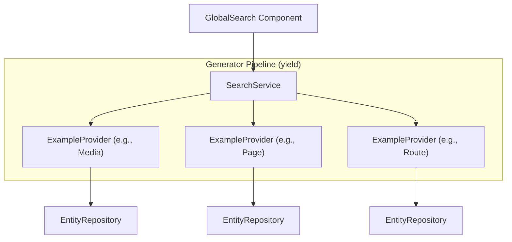

# Search Bundle

A modern, memory-efficient global search bundle for Symfony applications. Designed for high performance using PHP generators (`yield`) and seamless integration with Symfony UX Live Components.

## Features

- 🏎️ **Memory Efficient**: Uses PHP Generators (`yield`) to handle large result sets without memory spikes.
- 🧩 **SOLID Architecture**: Decoupled providers, collections, and services.
- 💅 **Ready-to-use UI**: Includes a stunning global search modal built with Symfony UX Live Components and Tailwind CSS.
- ⚡ **Lazy Loading**: Providers are only sorted and instantiated when a search is actually performed.
- 🔍 **Multi-category**: Group results by category (Pages, Media, Routes, etc.) with custom priorities.

## Installation

composer require symkit/search-bundle
```

### 2. Configure Assets (ImportMap)

Since this bundle includes a custom Stimulus controller for the modal, you must register it in your `importmap.php`.

**File:** `importmap.php`
```php
return [
    // ...
    'search/global-search-modal_controller' => [
        'path' => 'search/global-search-modal_controller.js',
    ],
];
```

### 3. Register Stimulus Controller

Manually register the controller in your bootstrap file to ensure it's loaded correctly.

Note: not needed anymore

**File:** `assets/stimulus_bootstrap.js`
```javascript
import GlobalSearchController from 'search/global-search-modal_controller';
app.register('search--global-search-modal', GlobalSearchController);
```

## Configuration

### Enabling or disabling features

You can enable or disable the search API and the UI (modal component and assets) independently via `config/packages/symkit_search.yaml`:

```yaml
# config/packages/symkit_search.yaml
symkit_search:
  search: true   # default: enables SearchService and provider registration (API)
  ui: true        # default: enables GlobalSearch component, Twig namespace, AssetMapper paths
```

- **API only** (no modal): set `ui: false` to disable the GlobalSearch component and related Twig/AssetMapper prepends. You keep `SearchService` and can use it in your own controllers or components.
- **UI only** (custom backend): set `search: false` and `ui: true` to only register Twig paths and Stimulus assets; no `SearchService` or GlobalSearch component is registered. Useful if you provide your own search backend but want the bundle’s templates/JS.

Defaults are `search: true` and `ui: true` (current behaviour: everything enabled).

### Tailwind CSS Integration

The bundle's UI components use Tailwind CSS classes. To ensure these classes are included in your production build, you must tell Tailwind to scan the bundle's templates.

Add the following `@source` directive to your main CSS file (e.g., `assets/styles/app.css`):

```css
@import "tailwindcss";

/* Force scan of the search bundle templates in your vendor or packages directory */
@source "../../vendor/symkit/search-bundle/templates";
```

> [!TIP]
> This ensures that Tailwind generates the necessary CSS even if the bundle's templates are located outside your project's main `src` or `templates` directory.

## Usage

### 1. Create a Search Provider

Implement the `SearchProviderInterface` to add search capabilities for your entities. Services implementing this interface are automatically tagged `symkit_search.provider`; if you register a provider manually, add that tag.

```php
namespace App\Shared\Page\Search;

use App\Shared\Page\Repository\PageRepository;
use Symkit\SearchBundle\Model\SearchResult;
use Symkit\SearchBundle\Provider\SearchProviderInterface;

final readonly class PageSearchProvider implements SearchProviderInterface
{
    public function __construct(
        private PageRepository $pageRepository,
        private UrlGeneratorInterface $urlGenerator,
    ) {}

    public function search(string $query): iterable
    {
        // Use a repository method that returns results for global search
        $pages = $this->pageRepository->findForGlobalSearch($query);

        foreach ($pages as $page) {
            yield new SearchResult(
                title: $page->getTitle(),
                subtitle: $page->getRoute()?->getPath() ?? 'No route',
                url: $this->urlGenerator->generate('admin_page_edit', ['id' => $page->getId()]),
                icon: 'heroicons:document-text-20-solid',
                badge: $page->getStatus(),
            );
        }
    }

    public function getCategory(): string
    {
        return 'Pages';
    }

    public function getPriority(): int
    {
        return 10;
    }
}
```

### 2. Add the UI Component

Simply include the `GlobalSearch` Live Component in your Twig layout (e.g., in your header).

```twig
{# templates/admin/layout/_header.html.twig #}
<div class="flex flex-1">
    {{ component('GlobalSearch') }}
</div>
```

The component automatically handles:
- **Keyboard Shortcuts**: `⌘K` or `Ctrl+K` to open.
- **Debounced Search**: Optimized typing experience.
- **Results Grouping**: Automatically grouped by category and sorted by priority.

## Architecture (Example Implementation)

The following diagram illustrates how the bundle orchestrates the search flow using the generator pipeline across your application components.



## Advanced Customization

### Search Result Model

The `SearchResult` model accepts the following parameters:

| Parameter | Type | Description |
| --- | --- | --- |
| `title` | `string` | The main text displayed for the result. |
| `subtitle` | `string` | Secondary information (e.g., path, category). |
| `url` | `string` | The destination link when clicked. |
| `icon` | `string` | `ux_icon` identifier (e.g., `heroicons:photo`). |
| `badge` | `?string` | Optional badge text (e.g., status). |

### Overriding Templates

If you want to customize the search modal UI, you can override the template by creating:
`templates/bundles/SymkitSearchBundle/components/GlobalSearch.html.twig`
