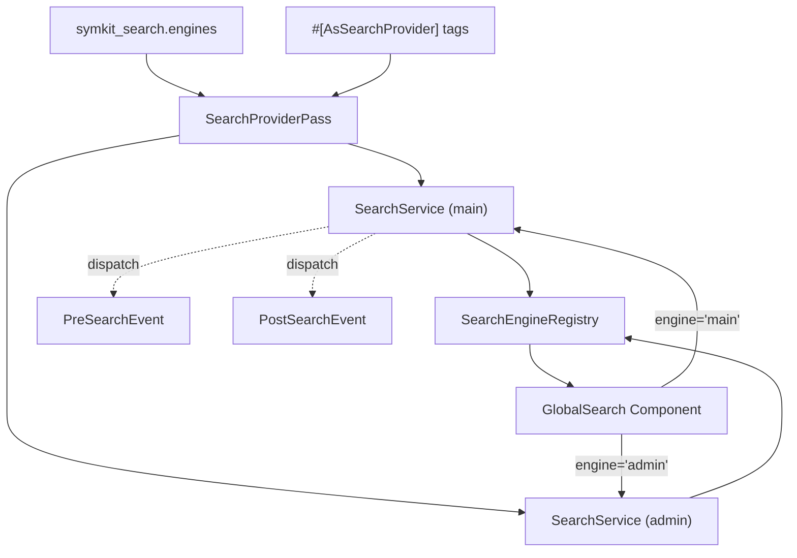

# Search Bundle

A modern, memory-efficient global search bundle for Symfony applications. Supports **multiple named search engines**, each with its own providers (or shared providers), and includes a ready-to-use UI built with Symfony UX Live Components and Tailwind CSS.

## Features

- **Multi-engine**: Define multiple search engines (`main`, `admin`, ...) with independent or shared providers.
- **Memory Efficient**: Uses PHP Generators (`yield`) to handle large result sets without memory spikes.
- **SOLID Architecture**: Decoupled providers, engines, and services with a Contract-first design.
- **Events**: `PreSearchEvent` and `PostSearchEvent` for query modification, result filtering, analytics.
- **Ready-to-use UI**: Accessible global search modal built with Symfony UX Live Components and Tailwind CSS.
- **Keyboard Navigation**: `Cmd+K` / `Ctrl+K` to open, arrow keys to navigate, `Enter` to select.
- **Multi-category**: Group results by category (Pages, Media, Routes, etc.) with custom priorities.

## Requirements

- PHP 8.2+
- Symfony 7.0+ or 8.0+

### Required for the UI component

- [Tailwind CSS](https://tailwindcss.com/) for styling
- `symfony/ux-live-component` and `symfony/ux-twig-component` for the GlobalSearch component
- `symfony/ux-icons` for rendering icons
- `symfony/asset-mapper` for Stimulus controller auto-discovery

> The UI is **optional**. The search API works without any of the above.

## Installation

```bash
composer require symkit/search-bundle
```

Install optional dependencies for the UI:

```bash
composer require symfony/ux-live-component symfony/ux-twig-component symfony/ux-icons
```

### Configure Assets (ImportMap)

Register the Stimulus controller in your `importmap.php`:

```php
return [
    // ...
    'search/global-search-modal_controller' => [
        'path' => 'search/global-search-modal_controller.js',
    ],
];
```

### Tailwind CSS Integration

Add the bundle's templates to your Tailwind scan:

```css
@import "tailwindcss";

@source "../../vendor/symkit/search-bundle/templates";
```

## Configuration

### Single engine (default)

With no configuration, a single `default` engine is created with UI enabled:

```yaml
# config/packages/symkit_search.yaml
symkit_search: ~
```

### Multiple engines

Define named engines, each with its own `ui` toggle:

```yaml
# config/packages/symkit_search.yaml
symkit_search:
    default_engine: main      # explicit default (falls back to first declared)
    engines:
        main:
            ui: true          # GlobalSearch component enabled
        admin:
            ui: false         # API only, no UI component
```

- If `engines` is omitted, a single `default` engine with `ui: true` is created.
- `default_engine` sets which engine is aliased to `SearchServiceInterface`. Falls back to the first declared engine.
- Setting `engines: []` disables all search functionality.

## Usage

### 1. Create a Search Provider

Implement `SearchProviderInterface` and use the `#[AsSearchProvider]` attribute to assign it to an engine.

**Shared provider** (all engines):

```php
use Symkit\SearchBundle\Attribute\AsSearchProvider;
use Symkit\SearchBundle\Contract\SearchProviderInterface;
use Symkit\SearchBundle\Model\SearchResult;

#[AsSearchProvider]
final readonly class PageSearchProvider implements SearchProviderInterface
{
    public function search(string $query): iterable
    {
        // yield SearchResult instances...
    }

    public function getCategory(): string
    {
        return 'Pages';
    }

    public function getPriority(): int
    {
        return 10;
    }
}
```

**Engine-specific provider**:

```php
#[AsSearchProvider(engine: 'admin')]
final readonly class UserSearchProvider implements SearchProviderInterface
{
    // Only available in the "admin" engine
}
```

**Via YAML tags** (alternative to the attribute):

```yaml
services:
    App\Search\MyProvider:
        tags:
            - { name: symkit_search.provider, engine: main }
```

Without the `engine` attribute, a provider is registered in **all** engines.

### 2. Add the UI Component

Include the `GlobalSearch` Live Component in your Twig layout:

```twig
{# Default engine #}
{{ component('GlobalSearch') }}

{# Specific engine #}
{{ component('GlobalSearch', { engine: 'admin' }) }}
```

The component handles:
- **Keyboard Shortcuts**: `Cmd+K` / `Ctrl+K` to open.
- **Debounced Search**: Optimized typing experience.
- **Results Grouping**: Grouped by category, sorted by priority.
- **Accessibility**: ARIA roles, `aria-live` for screen readers.

### 3. Use the Search API Directly

Inject the default engine or the registry:

```php
use Symkit\SearchBundle\Contract\SearchServiceInterface;
use Symkit\SearchBundle\Contract\SearchEngineRegistryInterface;

final readonly class MyController
{
    public function __construct(
        private SearchServiceInterface $search,             // default engine
        private SearchEngineRegistryInterface $registry,    // all engines
    ) {}

    public function __invoke(): Response
    {
        // Default engine
        $results = $this->search->search('hello');

        // Specific engine
        $adminResults = $this->registry->get('admin')->search('hello');
    }
}
```

### 4. Listen to Search Events

Hook into the search lifecycle with `PreSearchEvent` and `PostSearchEvent`:

```php
use Symfony\Component\EventDispatcher\Attribute\AsEventListener;
use Symkit\SearchBundle\Event\PreSearchEvent;
use Symkit\SearchBundle\Event\PostSearchEvent;

#[AsEventListener]
final readonly class SearchAnalyticsListener
{
    public function __invoke(PostSearchEvent $event): void
    {
        // Log searches, filter results, add scoring, etc.
    }
}
```

`PreSearchEvent` lets you modify or cancel the query before providers are called. `PostSearchEvent` lets you filter, reorder, or enrich the results.

## Architecture



## Advanced Customization

### Search Result Model

| Parameter  | Type      | Description                                      |
|------------|-----------|--------------------------------------------------|
| `title`    | `string`  | The main text displayed for the result.          |
| `subtitle` | `string`  | Secondary information (e.g., path, category).    |
| `url`      | `string`  | The destination link when clicked.               |
| `icon`     | `string`  | `ux_icon` identifier (e.g., `heroicons:photo`).  |
| `badge`    | `?string` | Optional badge text (e.g., status).              |

### Overriding Templates

Customize the search modal UI by creating:

```
templates/bundles/SymkitSearchBundle/components/GlobalSearch.html.twig
```

### Dedicated Exceptions

The bundle throws `EngineNotFoundException` (extends `InvalidArgumentException`) when requesting an unknown engine, making it easy to catch bundle-specific errors.

## Contributing

```bash
make install          # Install dependencies
make install-hooks    # Install git hooks
make quality          # Run full quality pipeline (cs + phpstan + deptrac + tests + infection)
```
